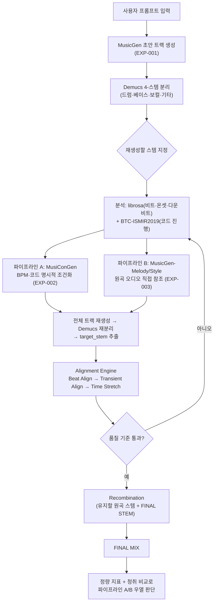

# Stem Remix Assistant

생성형 음악 모델로 만든 트랙에서 특정 스템(주로 드럼)만 재생성해 교체할 때, 전체를 처음부터 재작업하지 않도록 만든 파이프라인이다. 텍스트 프롬프트로 전체 트랙을 생성하고(MusicGen), 스템 단위로 분리한 뒤(Demucs), 원하는 스템만 재생성해 갈아 끼우는 생성 → 분리 → 재생성 루프를 Colab 무료 T4 환경에서 구현한다.

배경과 기술적 한계 검증, 전체 시스템 설계는 [`docs/PROPOSAL.md`](docs/PROPOSAL.md)에 정리되어 있다. 환경 세팅(로컬 VSCode + Colab 하이브리드)은 [`docs/ENVIRONMENT_SETUP.md`](docs/ENVIRONMENT_SETUP.md) 참고.

## 파이프라인

스템 단위 조건부 생성을 지원하는 모델은 아직 연구 단계에만 있고(비공개거나 미배포), MusicGen 계열은 구조적으로 전체 믹스만 출력한다. 재생성 대상 스템마다 전체 트랙을 다시 생성한 뒤 재분리해서 원하는 스템만 추출하는 방식을 쓴다.

타이밍 정확도와 원곡 유사도 중 어느 쪽이 더 중요한지 사전에 판단할 근거가 없어, 두 파이프라인을 각각 구현해 비교한다(설계 근거는 `docs/PROPOSAL.md` 2.3·4.1절).



> **Note**: `target_stem`은 생성 조건이 아니라 재분리 이후 추출할 스템을 가리키는 라벨이다. 생성 조건으로 직접 전달하면 음질이 저하된다 — 원인 분석과 해결 과정은 [`docs/troubleshooting/20261002_musicongendrumstemqualitydegradation.md`](docs/troubleshooting/20261002_musicongendrumstemqualitydegradation.md) 참고.

## 노트북

- [01_setup_and_test.ipynb](notebooks/01_setup_and_test.ipynb) — 환경 확인, MusicGen 단독 생성, Demucs 단독 분리 테스트 (EXP-001)
  [](https://colab.research.google.com/github/finneKIM/stem-remix-assistant/blob/main/notebooks/01_setup_and_test.ipynb)
- [02a_regenerate_musicongen.ipynb](notebooks/02a_regenerate_musicongen.ipynb) — EXP-002, MusiConGen 재생성 파이프라인(생성 → Demucs 재분리 → Alignment Engine), duration_sec 스윕 실험
  [](https://colab.research.google.com/github/finneKIM/stem-remix-assistant/blob/main/notebooks/02a_regenerate_musicongen.ipynb)

## 폴더 구조

```
docs/
  PROPOSAL.md               # 기획서
  ENVIRONMENT_SETUP.md      # 환경 세팅 가이드
  troubleshooting/          # 트러블슈팅 기록 (문제-원인-해결 md, 날짜별)
  samples/                  # 데모 오디오 샘플 (생성/분리 검증 결과물)
  experiments/              # 실험 간 비교 문서 (model_comparison.md)
notebooks/                  # Colab 노트북
src/                        # 파이프라인 코드
experiments/                # 실험별 config, 결과, 결론 기록 (규칙은 experiments/README.md 참고)
```

## 실험

여러 생성 모델과 조건화 방식을 실험 단위로 비교한다. 실험 규칙과 브랜치 전략은 [`experiments/README.md`](experiments/README.md) 참고.

| 실험 | 파이프라인 | 상태 |
|---|---|---|
| [EXP-001](experiments/exp_001_baseline/README.md) | 베이스라인 — MusicGen 생성 + Demucs 분리 | 완료 |
| [EXP-002](experiments/exp_002_musicongen/README.md) | A — MusiConGen (BPM·코드 명시적 조건화) | 진행 중 — target_stem 설계 정정 반영, 1차 검증 대기 |
| [EXP-003](experiments/exp_003_melody_style/README.md) | B — MusicGen-Melody/Style (원곡 오디오 직접 참조) | 예정 |

## 평가 설계 및 현재 상태

스템 조건부 생성의 정답 데이터가 없어 완전한 정답 비교 대신 다음 지표로 두 파이프라인을 비교한다(상세는 [`docs/experiments/model_comparison.md`](docs/experiments/model_comparison.md), 근거는 `docs/PROPOSAL.md` 4.3절).

- BPM 오차 — librosa로 측정한 원곡 BPM과 재생성 스템 BPM의 차이
- Beat/Onset alignment — librosa 비트·온셋 추적 기반 원곡-재생성 스템 일치도
- 코드 진행 일치도 — BTC-ISMIR2019로 추출한 원곡/재생성 스템 코드 시퀀스 비교
- 청취 평가 — 직접 들었을 때 원곡과 자연스럽게 어울리는지에 대한 주관 평가

**현재 상태**: EXP-002 검증이 끝나지 않아 위 지표는 아직 측정 전이다. EXP-003 구현 후 동일 기준으로 두 파이프라인을 비교할 예정이다.

## 설치 및 실행

별도 서버나 패키지 설치는 필요 없다. 전부 Colab 노트북 위에서 돌아간다.

1. 저장소 클론: `git clone https://github.com/finneKIM/stem-remix-assistant.git`
2. 위 "노트북" 목록의 Colab 배지를 클릭해 노트북을 연다.
3. 런타임 → 런타임 유형 변경에서 하드웨어 가속기를 T4 GPU로 설정한다.
4. 셀을 위에서부터 순서대로 실행한다. AudioCraft·Demucs·librosa 같은 패키지는 각 노트북의 설치 셀이 알아서 처리한다.

로컬 VSCode + Colab 하이브리드 작업 방식, 세션 복구 절차는 [`docs/ENVIRONMENT_SETUP.md`](docs/ENVIRONMENT_SETUP.md) 참고.

## 라이선스

이 저장소 코드 자체의 라이선스는 아직 정하지 않았다. 다만 파이프라인이 쓰는 모델 가중치 쪽은 각자 라이선스가 걸려 있다.

- MusicGen, MusiConGen 가중치 — CC-BY-NC 계열(비상업 한정)
- Demucs, librosa, BTC-ISMIR2019 — 오픈소스, 상업적 이용 제약 없음

이 파이프라인은 비상업적 데모·포트폴리오 용도로 한정한다(상세는 `docs/PROPOSAL.md` 2.2·3.2·6절).

## 진행 상태

- [x] 기획 완료
- [x] 환경 세팅 (Colab, AudioCraft, Demucs)
- [x] MusicGen 단독 생성 검증 (GPU 동작 확인, EXP-001)
- [x] Demucs 단독 분리 검증 (EXP-001)
- [x] 재생성/재조합 로직 설계 확정 (파이프라인 A/B 결정, 실험 프레임워크 구축)
- [x] 분석 도구 전환 (madmom → librosa + BTC-ISMIR2019) 및 검증
- [x] EXP-002 설계 정정 — target_stem을 생성 조건이 아닌 재분리 이후 추출 라벨로 수정
- [ ] EXP-002(MusiConGen) 1차 검증 — 진행 중
- [ ] EXP-003(MusicGen-Melody/Style) 구현
- [ ] 정량 평가 및 A/B 비교
- [ ] 결과 정리
